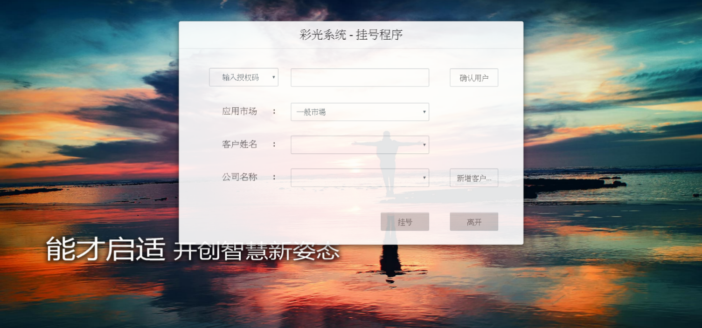

# 1.掛號程序

## 功能
* 使用者透過輸入手機或是授權碼的方式進行用戶確認。  
  * 若用戶確認成功，即可選取其對應的市場、用戶姓名等資訊來進行掛號。  
  * 若用戶確認失敗，則跳出警示窗，請用戶重新確認填寫的內容或進行會員註冊。  
* 尚未曾申請過會員的用戶，可點選"新增客戶"的按鈕，先進行註冊的動作。  

# 2. 客戶註冊系統

## 功能
* 欲申請會員的使用者在填寫基本資料後，點選"確認送出"後，將自動跳轉回掛號程序的頁面。  
* 系統將自動判斷該用戶所填寫的資料是否完整，以及是否為已註冊過的會員。 
